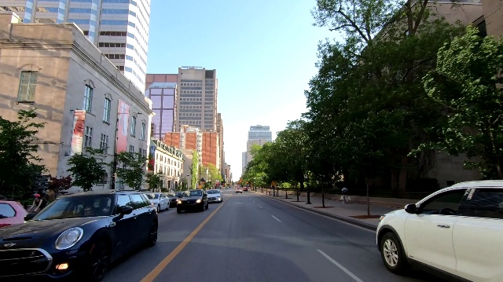
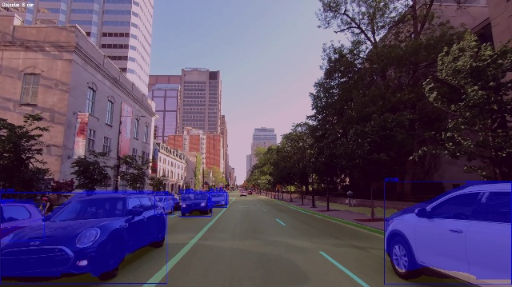

# 🚗 RoadVision AI

[](https://www.python.org/downloads/)
[](LICENSE)
[](https://opencv.org/)
[](https://pytorch.org/)
[](https://www.intel.com/content/www/us/en/developer/tools/openvino-toolkit/overview.html)
[](https://github.com/ultralytics/ultralytics)
[](https://github.com/Ard-Codder/roadvision-ai)
[](https://github.com/Ard-Codder/roadvision-ai)

> **Интегрированная система для детекции объектов и сегментации дороги с использованием YOLOv8 и OpenVINO**

[English](README.md) | [Русский](README.md)

---

## 📋 Содержание

- [🎯 Возможности](#-возможности)
- [🏆 Результаты работы](#-результаты-работы)
- [📦 Установка](#-установка)
- [🚀 Использование](#-использование)
- [📁 Структура проекта](#-структура-проекта)
- [🎨 Цветовая схема](#-цветовая-схема)
- [📊 Производительность](#-производительность)
- [🎯 Применение](#-применение)
- [🤝 Вклад в проект](#-вклад-в-проект)
- [📄 Лицензия](#-лицензия)
- [📞 Поддержка](#-поддержка)

---

## 🎯 Возможности

### Детекция объектов (YOLOv8-seg)
- 🚗 **Транспортные средства** - машины, грузовики, автобусы, мотоциклы, велосипеды, поезда, самолеты, лодки
- 👥 **Люди** - пешеходы, водители, пассажиры
- 🚦 **Дорожная инфраструктура** - знаки, светофоры, паркоматы, гидранты, скамейки
- 🏗️ **Дорожные объекты** - столбы, фонари, ограждения, строительные объекты
- 🌳 **Природа** - деревья, растения, трава
- 🏢 **Здания и сооружения** - здания, дома, мосты, туннели
- 🐕 **Животные** - собаки, кошки, лошади, коровы, слоны, медведи, зебры, жирафы

### Сегментация дороги (OpenVINO)
- 🛣️ Дорога (синий цвет)
- 🚧 Бордюр (зеленый цвет)
- 🎯 Дорожная разметка (желтый цвет)
- 🌍 Фон (темно-фиолетовый цвет)

## 🏆 Результаты работы

### Пример обработки видео

| Входное видео | Обработанное видео |
|:-------------:|:------------------:|
|  |  |

> **Пример:**
> - Слева — оригинальное видео с улицы
> - Справа — результат работы системы: сегментация дороги, разметки, бордюров, детекция и сегментация объектов (машины, люди, знаки и др.)
> - Маски прозрачные, видео не темнеет, все объекты выделены цветом и bbox
> 
> **📹 Полные видео:** [Входное](videos/input/4644521-uhd_2562_1440_30fps.mp4) | [Обработанное](videos/output/processed_4644521-uhd_2562_1440_30fps.mp4)

---

## 📦 Установка

### Быстрая установка
```bash
# Клонирование репозитория
git clone https://github.com/Ard-Codder/roadvision-ai.git
cd roadvision-ai

# Установка зависимостей
pip install -r requirements.txt

# Тестирование системы
python test_system.py
```

### Установка через pip
```bash
pip install roadvision-ai
```

### Установка в режиме разработки
```bash
git clone https://github.com/Ard-Codder/roadvision-ai.git
cd roadvision-ai
pip install -e .
```

---

## 🚀 Использование

### Обработка видео

1. **Поместите видео файлы в папку `videos/input/`**

2. **Запустите обработку:**
```bash
# Показать список видео
python process_videos.py --list

# Обработать все видео
python process_videos.py --process-all

# Обработать конкретное видео
python process_videos.py --process video.mp4

# Интерактивный режим
python process_videos.py
```

3. **Результаты сохраняются в `videos/output/`**

### Обработка изображений
```bash
python run_road_detection.py
```

### Windows (bat-файлы)
```bash
# Основное меню
run_system.bat

# Обработка видео
run_video_processing.bat

# Быстрая обработка всех видео
quick_process.bat
```

### Примеры использования
```bash
# Базовый пример
python examples/basic_usage.py

# Интерактивный режим
python run_road_detection.py

# Обработка видео
python process_videos.py --process-all
```

### Jetson Orin
```bash
# Переход в папку Jetson
cd jetson_orin

# Установка зависимостей
pip install -r requirements_jetson.txt

# Запуск с камерой
python road_detection_jetson.py

# Запуск с параметрами
python road_detection_jetson.py --camera 0 --cpu-only
```

---

## 📁 Структура проекта

```
roadvision-ai/
├── integrated_road_detection.py  # Основной класс системы
├── process_videos.py             # Обработка видео
├── run_road_detection.py        # Интерактивный запуск
├── test_system.py               # Тестирование
├── setup.py                     # Установка проекта
├── requirements.txt              # Зависимости
├── README.md                    # Документация
├── CHANGELOG.md                 # История изменений
├── CONTRIBUTING.md              # Руководство по вкладу
├── LICENSE                      # Лицензия
├── .gitignore                   # Git игнорирование
├── examples/                    # Примеры использования
│   └── basic_usage.py          # Базовый пример
├── tests/                       # Тесты
├── docs/                        # Документация
│   └── results/                 # Результаты работы
├── jetson_orin/                # Версия для Jetson Orin
│   ├── road_detection_jetson.py
│   ├── requirements_jetson.txt
│   └── README_JETSON.md
├── videos/                      # Папка для видео
│   ├── input/                   # Входные видео
│   └── output/                  # Обработанные видео
├── model/                       # Модели
│   ├── yolov8n-seg.pt
│   ├── yolov8n.pt
│   ├── road-segmentation-adas-0001.xml
│   └── road-segmentation-adas-0001.bin
└── run_system.bat               # Windows меню
```

---

## 🎨 Цветовая схема

### Объекты (по категориям)
- 🟢 **Люди** - зеленый
- 🔵 **Транспорт** - синий  
- 🔴 **Знаки и светофоры** - красный
- 🟡 **Дорожные объекты** - желтый
- 🟣 **Мебель** - фиолетовый
- 🟠 **Строительные объекты** - оранжевый
- 🌳 **Природа** - темно-зеленый
- 🏢 **Здания** - серый
- 🐕 **Животные** - розовый

### Дорога
- 🔵 Дорога - синий
- 🟢 Бордюр - зеленый
- 🟡 Разметка - желтый
- 🟣 Фон - темно-фиолетовый

---

## 📊 Производительность

- **FPS**: 15-25 кадров/сек (зависит от оборудования)
- **Точность**: Высокая точность детекции объектов и сегментации дороги
- **Память**: ~2-3 GB RAM для моделей
- **Объекты**: 30+ классов объектов улицы
- **Оптимизация**: Предотвращение затемнения при множественных объектах

---

## 🎯 Применение

- 🚗 Автономное вождение
- 🛣️ Анализ дорожной обстановки
- 📊 Статистика трафика
- 🚦 Управление светофорами
- 🎥 Видеонаблюдение
- 🌳 Анализ городской среды
- 🐕 Мониторинг животных
- 🏢 Анализ инфраструктуры

---

## 🔍 Детектируемые объекты

### Транспорт (🔵)
- car, truck, bus, motorcycle, bicycle, train, airplane, boat

### Люди (🟢)
- person

### Дорожная инфраструктура (🔴🟡)
- stop sign, traffic light, fire hydrant, parking meter, bench

### Дорожные объекты (🟠🟡)
- pole, street light, construction, fence

### Природа (🌳)
- tree, plant, grass

### Здания (🏢)
- building, house, bridge, tunnel

### Животные (🐕)
- dog, cat, horse, sheep, cow, elephant, bear, zebra, giraffe

---

## 🤝 Вклад в проект

Мы приветствуем вклады от сообщества! См. [CONTRIBUTING.md](CONTRIBUTING.md) для подробностей.

### Как внести вклад
1. Форкните репозиторий
2. Создайте ветку для новой функции
3. Внесите изменения
4. Добавьте тесты
5. Создайте Pull Request

---

## 📄 Лицензия

Проект распространяется под MIT License. См. [LICENSE](LICENSE) для подробностей.

---

## 📞 Поддержка

- 📧 **Issues**: [GitHub Issues](https://github.com/Ard-Codder/roadvision-ai/issues)
- 📖 **Документация**: [README.md](README.md)
- 🚀 **Jetson Orin**: [README_JETSON.md](jetson_orin/README_JETSON.md)
- 📋 **Объекты**: [OBJECTS_SUMMARY.md](OBJECTS_SUMMARY.md)

---

## 🏆 Статистика проекта

- ⭐ **Звезды**: 0
- 🔄 **Форки**: 0
- 🐛 **Issues**: 0
- 📦 **Релизы**: 1
- 👥 **Контрибьюторы**: 1

---

**RoadVision AI** - мощная система для анализа дорожной обстановки с поддержкой реального времени! 🚗✨ 